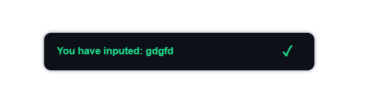
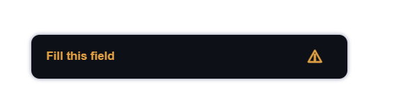
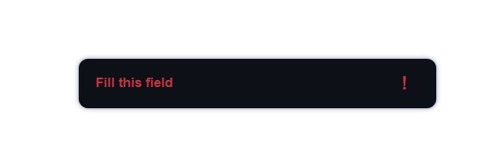

## Mini notification system for your web application

__Developed using technologies:__
* Native javascript
* Less
* Html/css

__Advantages:__
* It has a smooth animation while appearing and disappearing
* Eye pleasant and soft design
* Adaptive for mobile devices
* Easy to modify

---

### Instruction

__First of all you need to understand that the system based on a javascript object__

__Code:__

---
    // Message system
    const message = {
        saveMessage(text, type) {
            const obj = {
                text: text,
                type: type
            };

            // Saving message in localstorage
            localStorage.setItem('message', JSON.stringify(obj));
        },
        removeMessage() {
            localStorage.removeItem('message');
        },
        checkMessage() {
            const item = localStorage.getItem('message');

            // If message exists in localstorage -> show it
            if (item) {
                const text = JSON.parse(item);
                this.createMessage(text.text, text.type);
                this.removeMessage();
            }

            else return false;
        },
        createMessage(text, type = 'success') {
            const message = document.createElement('div');
            message.classList.add(type + '-message');
            message.innerText = text;
            document.body.appendChild(message);

            // Message destruction
            setTimeout(() => message.remove(), 3000);
        }
    }
---

As we can see it is very easy)

__Firstly we should include the js file to our html \<head>__
You can do it by having inputed the following command in your \<head> of html file

    <head>
        
    </head>

__Next step you should do is to include a css file the same way__
    
    <head>
        
        <link rel="stylesheet" href="path/notify/message.css">
    </head>

__All is ready for start working__

__In order to create certain message on your page you can use the  next command in your javascript file:__

    message.createMessage('Some text');

The first defined argument is text you desire to show in message
You can define also the second argument (___type___ of message) default ('success')
There are three types of message:

* Success
    

        message.createMessage('You have inputed: gdgfd');
   
---
* Warning
    

        message.createMessage('Fill this field', 'warning');

---
* Error
    

        message.createMessage('Fill this field', 'error');

__But this is not the end!__
__If you want to inform user about something after reloaded page you can use the next command:__

    message.saveMessage('You have entered successfully');

So, how it works? - It's simple:
___message.saveMessage();___ -  saves your message as object in localstorage and after the page was reloaded function ___message.checkMessage();___ - finds message in localstorage and if message was saved -> the function shows it and then removes message from localstorage, so you can repeat it a lot of times. 

__*But before save message you sould input the next command in your main js file:__

    window.onload = () => {
        message.checkMessage();
    }

What it does? -> This function will be run after every page reload and ckeck your localstorage for message existence.

__But you might want to change design of these messages. Well, You can do it even if you don't know less technology__
Fitstly, you should find the styles.css file in directory of this system and change styles provided that you know css.

__This is an example of how you can use it:__

    function check_inputs(input_id) {
        const input = document.querySelector(input_id).value;
        if (!input || input == '') message.createMessage('Fill this field', 'error');
        else {
            message.saveMessage('You have inputed: ' + input);
            location.reload();
        }
    }   

### Well, enjoy and relax :)
Developed by __Oleg Stelmashchuk__

-> [Github](https://github.com/Q-sedifo)
-> [Instagram](https://www.instagram.com/oleg_s.t/)
